 

## 👋 Chi sono · About me

<table>
<tr>
<td width="50%" valign="top">

### 👨‍🍳 Lo Chef · The Chef

🇮🇹 Chef de Partie con laurea in **Arti Culinarie** (Accademia Italiana di Cucina, Firenze). Ho cucinato tra Roma, Firenze, la Sicilia, Birmingham e il fine dining di Copenhagen.

🇬🇧 Chef de Partie with a degree in **Culinary Arts** (Italian Culinary Academy, Florence). I've cooked across Rome, Florence, Sicily, Birmingham and Copenhagen fine dining.

- 🍝 Pasta fresca artigianale · *handmade fresh pasta*
- 🔥 Griglia a carbone Josper · *Josper charcoal grill*
- 🧪 Gastronomia molecolare · *molecular gastronomy*

</td>
<td width="50%" valign="top">

### 💻 Il Dev · The Dev

🇮🇹 IT enthusiast · Homelab & Automation. Software open source nato da problemi veri di casa.

🇬🇧 IT enthusiast · Homelab & Automation. Open-source software born from real problems at home.

- 🏠 Homelab su Raspberry Pi con Docker · *self-hosted on a Raspberry Pi*
- 🧩 Home Assistant · Traefik · Pi-hole · Nextcloud · WireGuard · tunnel Cloudflare
- 🌱 Co-fondatore di [**Arborae**](https://arborae.github.io) · *co-founder of Arborae*

</td>
</tr>
</table>

## ✨ Progetti in evidenza · Featured projects

<table>
<tr>
<td width="50%" valign="top">

#### 🐳 [d2ha — Docker to Home Assistant](https://github.com/arborae/docker2homeassistant)

Container Docker dentro Home Assistant, web UI moderna e autodiscovery MQTT. 
*Docker containers inside Home Assistant, modern web UI & MQTT autodiscovery.*

[📖 Documentazione · Docs](https://arborae.github.io/docker2homeassistant/)

</td>
<td width="50%" valign="top">

#### 🎵 [widget-spotify](https://github.com/giosci1994/widget-spotify)

Mini-telecomando Spotify nella system tray di Windows. 
*Spotify remote in the Windows tray.*

`Electron` `Spotify Web API`

</td>
</tr>
<tr>
<td width="50%" valign="top">

#### 🌱 [Arborae](https://arborae.github.io)

Organizzazione open source che ho co-fondato: software pulito, modulare e documentato. 
*Open-source org I co-founded: clean, modular, documented software.*

</td>
<td width="50%" valign="top">

#### 🧩 [ha-appliance](https://github.com/arborae/ha-appliance) `in sviluppo · WIP`

Appliance modulare per Home Assistant. 
*Modular appliance for Home Assistant.*

</td>
</tr>
<tr>
<td width="50%" valign="top">

#### 🔧 [feature-overrides-registry](https://github.com/giosci1994/feature-overrides-registry)

Sblocca il supporto NVMe nativo sperimentale su Windows. 
*Unlocks experimental native NVMe support on Windows.*

</td>
<td width="50%" valign="top">

#### 🏠 Homelab

Raspberry Pi con Docker: Home Assistant, Traefik, Pi-hole, Nextcloud, WireGuard, tunnel Cloudflare. 
*Self-hosted on a Raspberry Pi.*

</td>
</tr>
</table>

## 📦 Repository pubblici · Public repositories

Aggiornati automaticamente ogni giorno · updated automatically every day

<!-- REPOS:START -->

| Repository | Descrizione · Description | Linguaggio · Language | Ultimo push · Last push |
| :-- | :-- | :-- | :-- |
| [**widget-spotify**](https://github.com/giosci1994/widget-spotify) [🔗](<https://giosci1994.github.io/widget-spotify/>) | 🎵 Spotify remote in the Windows system tray — now playing, controls & device switch (Echo/PC/phone). Electron + Spotify Web API… | JavaScript | set 2026 |
| [**webapp-palestra**](https://github.com/giosci1994/webapp-palestra) [🔗](<https://giosci1994.github.io/webapp-palestra/>) | 🏋️‍♂️ Complete microservice architecture platform for gym management with Web Dashboard, Telegram Bot & Automated Scraper. | JavaScript | set 2026 |
| [**rejuvenation-ita-patch**](https://github.com/giosci1994/rejuvenation-ita-patch) [🔗](<https://giosci1994.github.io/rejuvenation-ita-patch/>) | 🇮🇹 Complete unofficial Italian translation patch for Pokémon Rejuvenation — 99.9% of the game's text | Python | set 2026 |
| [**PC-MQTT-Notifier**](https://github.com/giosci1994/PC-MQTT-Notifier) [🔗](<https://giosci1994.github.io/PC-MQTT-Notifier/>) | 🔔 Lightweight Windows notification overlay for MQTT & Home Assistant — customizable scale, transparency, fluid background, tray… | Python | lug 2026 |
| [**giosci1994.github.io**](https://github.com/giosci1994/giosci1994.github.io) [🔗](<https://giosci1994.github.io>) | 👨‍🍳💻 Personal site of Giovanni La Cascia — Chef by day, Dev by night. Split-screen, dual-theme, bilingual IT/EN. Vanilla… | HTML | lug 2026 |
| [**kitchen-app**](https://github.com/giosci1994/kitchen-app) [🔗](<https://giosci1994.github.io/kitchen-app/>) | Modern Kitchen & Restaurant Management Platform (PWA, Inventory, Recipes, Prep-Lists & Docker ready) | TypeScript | lug 2026 |
| [**feature-overrides-registry**](https://github.com/giosci1994/feature-overrides-registry) [🔗](<https://github.com/giosci1994/feature-overrides-registry/releases/latest>) ⭐ 1 | Enable/Disable hidden Windows Feature Management overrides to unlock experimental Native NVMe support. Includes scripts, .exe… | PowerShell | lug 2026 |

<!-- REPOS:END -->

## 🧰 Il mio stack · My toolbox

**Homelab & Automation**

**Dev**

## 📊 GitHub

<picture>
  <source media="(prefers-color-scheme: dark)" srcset="https://raw.githubusercontent.com/giosci1994/giosci1994/output/stats-dark.svg" />
  
</picture>
<picture>
  <source media="(prefers-color-scheme: dark)" srcset="https://raw.githubusercontent.com/giosci1994/giosci1994/output/languages-dark.svg" />
  
</picture>

<picture>
  <source media="(prefers-color-scheme: dark)" srcset="https://raw.githubusercontent.com/giosci1994/giosci1994/output/activity-dark.svg" />
  
</picture>

---

*fatto con ❤️ tra fornelli e container · made with ❤️ between stoves and containers*

